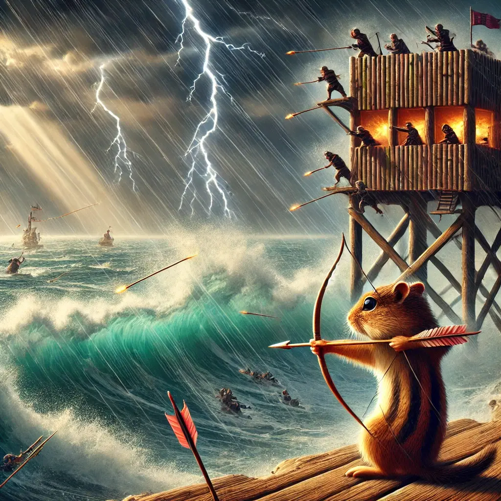

<!-- # gopher-bench -->
<div align='center'>
<!-- img src="assets/images/gopher-shoot.webp" width=75%  height=300px> -->

<hr>

### **✨ Your Personal Benchmarking Tool✨**


[](https://github.com/namansharma18899/gopher-bench/blob/main/LICENSE)
[](https://github.com/namansharma18899/gopher-bench/network)
[](https://github.com/namansharma18899/gopher-bench/issues)
[](https://github.com/namansharma18899/gopher-bench/commits/main)

*If you like my work a ⭐ would mean the world*
</div>

---

## 🌎 Overview
The gopher-bench is a benchmarking tool written in Go

## 🫧 Features
- **Beginner Friendly**: Easy to use & configure.

- **Go Power**: Developed to leverage Go's multithreading...

## 🤨 Why
- Inspired by WRK2 : )

## ⚙️ Setup
```bash
$ cd gopher-bench/
$ go get github.com/olekukonko/tablewriter
$ go run .
```

## 🤗 Support
- Make sure to leave a ⭐ if you like this project.
